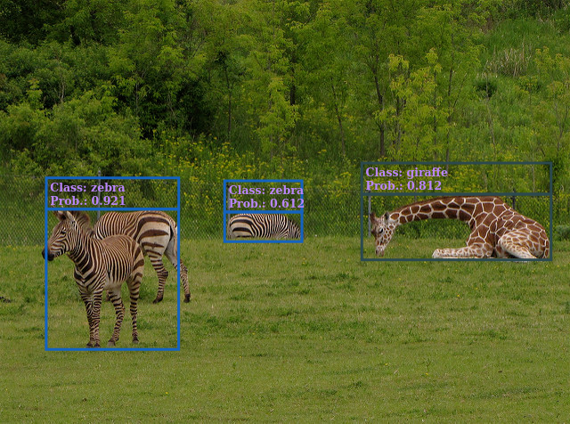

# COCO SDD web application

A small web application for object recognition over image and video.

The application is available at [this webpage](https://pheithar.github.io/coco_ssd_web/).

The webpage uses the [COCO SSD model](https://github.com/tensorflow/tfjs-models/tree/master/coco-ssd) with the [tensorflow js framework](https://www.tensorflow.org/js?hl=en-419) to create a small object detection application. In this application there are 5 images and 2 videos to preview, but you can upload your own images or videos to try it out. You can use your webcam too.

The COCO SSD is a pre-trained model over 90 different classes, and can identify multiple objects in a single image. I used the *TensorFlow.js* version of it, but the original paper is available through [this link](https://arxiv.org/abs/1512.02325).

This small project is focused on the deployment of the network, rather than in doing further training, and can be seen as a testing tool to get the accuracy of the model.
